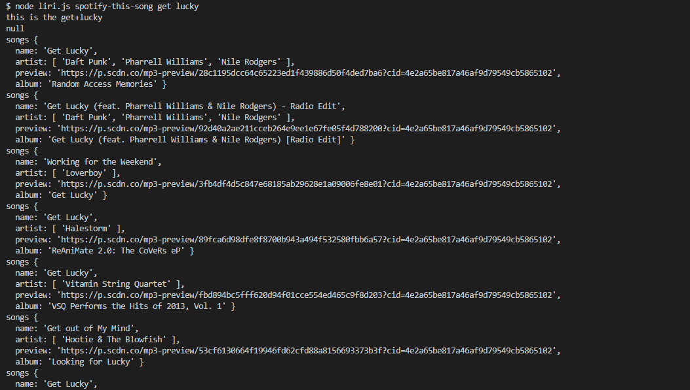

# Liri-node-app

A text base interpetation and interface app that uses node.js 

# Install
You need the following node packages to run the program

+ Dotenv
+ Node-Spotify-Api
+ Request
+ Moment
+ File-Sytstem

# Usage
Their are 4 commands that this application will take in
+ format
```terminal

node liri.js task search-term

```

+ ### concert-this
  + search a band and the app will return an array of objs
  
  ``` javascript 
  function events( venue,date){
    this.name=venue.name
    this.country=venue.country
    this.city=venue.city
    this.date=moment(date).format(MM/DD/YY)

   }
  ```
 
+ ### spotify-this-song
  + search a song and the app will return an array of songs that match the search 
  
  ``` javascript 
  function songs(song){
    this.name=song.name
    this.artist=[]
    this.preview=song. preview_url
    this.album=song.album.name
    }
  ```
   
+ ### movie-this
  + search a movie and the app will return and the app will retrun a movie obj
  
  ``` javascript 
  function movie(movie){
    
    this.title=movie.Title
    this.year=movie.Year
    this.imdb_rating=movie.imdbRating
    this.rotten_tomato_rating=movie.Ratings[1].Value
    this.country=movie.Country
    this.language=movie.Language
    this.plot=movie.Plot
    this.actors=movie.Actors
  }

  ```
   
+ ### do-what-it-says
  This command will run take commands from the random.txt. The commands in the text file need to follow the same format as if you where 
  
  to enter it into the terminal
  
  ex. movie-this pacific rim
  
  note. in the log when you see a do-what-it-says null  the entry right next to it should be the exact same entry that 
  
  you should see in you random.txt file
  
   
  

  


